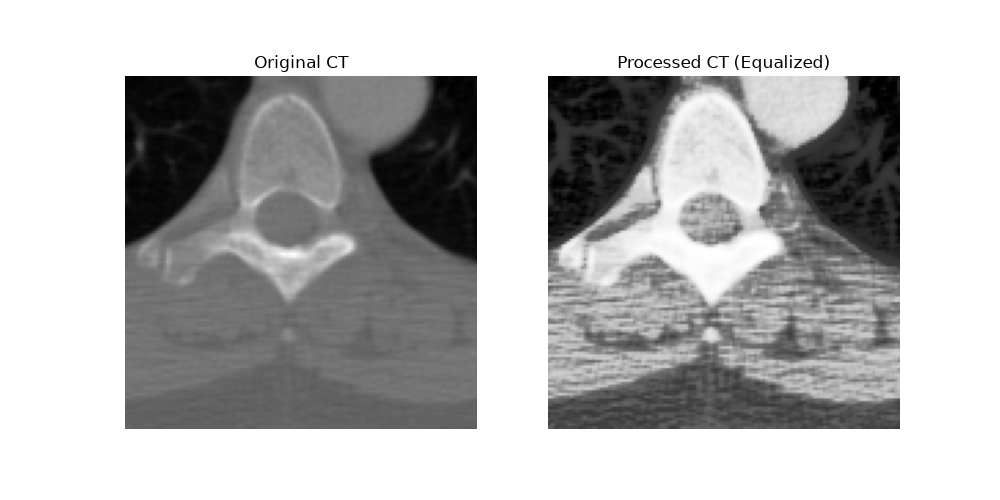

Readme · MD
# DICOM CT Preprocessor
 
A small Python script that reads a real medical imaging (DICOM) file, extracts its pixel data as a NumPy array, and enhances tissue/bone contrast using histogram equalization.
 
## What it does
 
CT scans don't store pixel values in the usual 0-255 range like normal images — they use the Hounsfield Unit (HU) scale, which can range from around -1000 (air) to +3000+ (dense bone). This script:
 
1. Reads a sample CT DICOM file using `pydicom`
2. Extracts the pixel matrix and prints basic patient/scan info (Patient ID, Modality, dimensions)
3. Applies **min-max normalization** to scale the pixel values into the standard 0-255 range
4. Applies **histogram equalization** (`cv2.equalizeHist`) to boost contrast and reveal detail that's hard to see in the raw scan
5. Plots the original vs. processed image side by side and saves it as `ct_comparison.png`
## Result
 

 
Left: original (normalized) CT slice. Right: after histogram equalization — bone structure and surrounding tissue detail become much more visible.
 
## Requirements
 
```
pydicom
numpy
opencv-python
matplotlib
```
 
Install with:
 
```bash
pip install -r requirements.txt
```
 
## Usage
 
```bash
python dicom_viewer.py
```
 
This will print the scan's metadata to the console and save `ct_comparison.png` in the same folder.
 
## Notes
 
- Uses the sample `CT_small.dcm` file that ships with `pydicom`, so no external dataset download is needed.
- Histogram equalization is a classic image processing technique used to spread out pixel intensity distribution, making subtle structural details easier to distinguish — useful in radiology for spotting bone/tissue boundaries.
 
